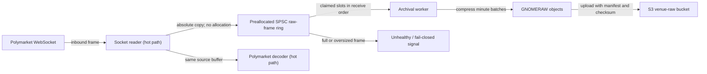

# Zero-GC raw capture design

Status: Implemented locally for research collection; production isolation pending
Scope: Polymarket collector ingress and lossless archival handoff
Decision owner: Gnome trading runtime maintainers

## Decision

The socket-reader thread must copy each inbound frame into a preallocated, bounded, single-producer/single-consumer ring. It must not allocate, block on compression or S3, mutate the decoder's buffer position, or silently discard a frame.

For the current research collector, a background archival worker may compress and upload data. Before the collector shares a JVM with trading logic, the archival worker must move to an isolated process or sidecar so its allocations and stop-the-world garbage collections cannot pause the trading JVM.



The decoder and archival branch observe the same frame and receive timestamp. Only the archival worker can release a claimed slot for reuse.

## Evidence from the superseded implementation

The superseded experimental path allocated on the socket-reader thread:

- `SocketReader.doWork()` calls `ByteBuffer.asReadOnlyBuffer()` for every read.
- `RawMarketDataCollector.onMessage()` creates a new `byte[]` for every read.
- The synchronized callback performs compression-stream writes before decoding continues.

The current capture sample contained 2,019 frames. The largest frame was 6,592 bytes, the p95 frame was 4,723 bytes, and the observed peak was 11 frames per second. These measurements are a sizing baseline, not a protocol limit.

`gnome-core` supplies the required initialization-time ring primitive:

- `OneToOneRingBuffer<T>` preallocates every slot and supports one producer and one consumer.

## Ingress contract

The raw observer should receive explicit bounds over the decoder's existing buffer:

```java
void onMessage(
        ByteBuffer source,
        int sourceOffset,
        int length,
        long receiveTimestampNanos) throws IOException;
```

The contract has these rules:

1. `onMessage` cannot change `source.position()` or `source.limit()`.
2. It uses an absolute bulk copy into the claimed slot; it cannot create a slice, duplicate, read-only view, array, lambda, exception, or log message on the successful path.
3. It fails closed when the ring is full or the frame exceeds the configured slot capacity.
4. A rejection records a terminal collector failure and makes collector health fail. Lossless capture must never overwrite unread data or silently continue.
5. Handler installation and replacement are initialization operations. The handler reference is not changed while the reader is running.

## Preallocated slot

Each `RawFrame` is created before the socket connects and owns:

- one fixed-capacity byte array;
- receive timestamp;
- payload length;

Initial research sizing should use 256 slots of 64 KiB each, consuming 16 MiB plus ring metadata. At the observed peak, that holds more than 23 seconds of frames. Slot size and ring capacity remain explicit startup settings and powers of two where required.

An oversized frame or saturated ring is a correctness incident. The collector must report the exact counter and become unhealthy; it must not truncate a frame.

## Archival worker boundary

The consumer reads slots in ring order and writes the existing GNOMERAW v1 framing:

1. eight-byte magic;
2. format version and listing ID;
3. receive timestamp and payload length;
4. exact payload bytes.

The worker owns compression, minute rollover, checksum calculation, manifest creation, and S3 calls. Those operations must never run on the socket-reader thread.

For the research collector, the worker can remain a dedicated thread while we validate data correctness. For a trading runtime, thread separation is insufficient because JVM garbage collection can pause all threads. The production boundary is a separate process or sidecar connected through a bounded IPC transport with the same fail-closed semantics.

## Failure behavior

| Condition | Required behavior |
|---|---|
| Ring full | Reject claim, increment saturation counter, make health fail |
| Frame larger than slot | Reject frame, increment oversized counter, make health fail |
| Compression or upload failure | Retain failure state, stop accepting ingress, and make health fail |
| S3 latency spike | Consume available ring capacity; fail health before overwrite |
| Reconnect | Preserve raw frame order and receive timestamps across the new socket stream |
| Shutdown | Stop ingress, drain committed slots, close batch, upload manifest, then exit |

## Verification status and remaining gates

Completed locally:

- compiled hot-path methods contain no `new`, `newarray`, `anewarray`, or `multianewarray` bytecodes outside constructors and exception-only branches;
- a warmed allocation-counter test reports zero bytes allocated by successful `onMessage` calls;
- source position and limit are unchanged after capture;
- an oversized frame fails health without truncation;
- deterministic ring saturation fails health without overwriting the claimed frame;
- focused archive tests preserve byte-for-byte payloads, ordering, and receive timestamps;
- deterministic venue replay passes using the freshly packaged collector artifact.

Still required before production use:

- a one-hour soak reports zero ingress drops and no socket-thread allocation events;
- the acceptance report shows raw/normalized parity and valid manifests after reconnect and shutdown tests.

## Implementation sequence

1. Change the gateway observer contract to explicit source bounds and remove `asReadOnlyBuffer()`.
2. Add preallocated `RawFrame` objects backed by `OneToOneRingBuffer` from `gnome-core`.
3. Move GNOMERAW compression and S3 upload to a dedicated consumer agent.
4. Add health state and counters for saturation, oversized frames, and invalid bounds.
5. Prove zero allocation and replay equivalence in a focused gateway/orchestrator PR.
6. Before trading, move the archival worker out of the trading JVM and repeat the soak and latency gates.

## Non-goals

- This design does not change the Polymarket parsing rules.
- It does not alter the GNOMERAW v1 storage format.
- It does not authorize a live collector redeployment during the current acceptance window.
- It does not claim that the current research archival path is production trading-ready.
